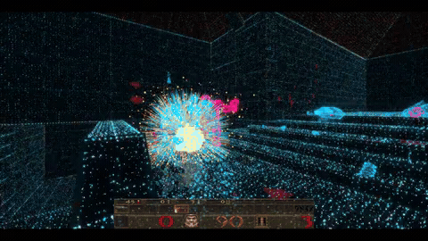

# ✨ Particle Quake: Aftershock

**Quake, rebuilt out of light and rubble.** A Windows x64 vkQuake fork that
replaces world and model geometry with a GPU point-cloud renderer, adds a
cosmetic reactive-physics glow layer, and bolts on real **NVIDIA PhysX +
Blast** wall destruction — rockets can blow structural, walk-through holes
in the map.



> 🆕 **New:** High-fidelity HDR + floor reflections for Neon Cathedral, with live launcher/console toggles. See [fidelity controls](docs/PARTICLE_FIDELITY.md).

[Download the full 60s clip](https://github.com/CrazyKickBoxer/particle-quake-aftershock/releases/download/v0.1.0/ParticleQuake-Aftershock-neon-cathedral.mp4) (H.264/MP4, 1280×720, 79MB) — GitHub forces a download rather than inline playback for release assets in every browser, so the GIF above is what actually plays on this page.

> ⚠️ **Honesty check:** this build implements and verifies the central
> wall-breach experience. It is **not** the completed release described by
> every requirement in `PARTICLE_QUAKE_BUILD_PROMPT.md`. See
> [feature status](docs/FEATURES.md) for the full verified / implemented /
> limited / not-started breakdown — no marketing gloss, just the table.

---

## 🎨 What makes it different

| | |
|---|---|
| 🌌 **Point-cloud renderer** | Every wall, floor, and monster redrawn as dense fields of colored points instead of triangles |
| 🎭 **14 material styles** | `faithful` → `cosmic-dust`, each a distinct animated palette — see [particle modes](docs/PARTICLE_MODES.md) |
| 🏛️ **Neon Cathedral preset** | Cyan/gold architecture, magenta monster silhouettes, HDR bloom, screen-space floor reflections |
| 💥 **Real destruction** | PhysX + Blast fracture actual wall sections; rubble physically blocks movement, not just visuals |
| ✨ **Holo Physics** | A cosmetic GPU disturbance layer that reacts to combat — verified to never touch `SV_Move`, `SV_TraceLine`, or the gameplay RNG |
| 🩸 **Gore & goo** | Directional gib physics, wall splashes, floor slides |

Full technical writeup (real buffer sizes, dispatch shapes, measured frame
times, no invented numbers): [RELEASE_REPORT.md](RELEASE_REPORT.md).

---

## 📥 Download

Grab the latest build from the **[Releases page](https://github.com/CrazyKickBoxer/particle-quake-aftershock/releases/latest)**:

| File | What it is |
|---|---|
| `ParticleQuake-Aftershock-v0.1.0-setup.exe` | 🖥️ Installer — per-user, Start Menu shortcut, clean uninstall, **no admin rights needed** |
| `ParticleQuake-Aftershock-v0.1.0-win64.zip` | 📦 Portable — unzip and run, no install |
| `ParticleQuake-Aftershock-v0.1.0-source.zip` | 🧬 GPL source snapshot (or just clone this repo) |

> 🚫 **No Quake game data ships in any of these.** You need your own legally
> obtained copy — Steam, GOG, or the free official shareware episode. The
> launcher can find an existing Steam/GOG install for you (registry +
> library-folder scan, read-only, nothing downloaded), or point you at the
> official shareware release. See [Play](#-play) below.

---

## ▶️ Play

Open `bin/vkquake_launcher.exe` (or the installed Start Menu shortcut).

Click **Find Steam/GOG** to auto-detect an existing install, or **Get
shareware Quake** to open the official free release. Then select **Rocket
demo setup → Launch Aftershock** to watch real rockets destroy an
automatically extracted wall in `e1m1` — a fixed camera, scripted inputs,
540 engine frames, an actual weapon test rather than a scripted explosion.
Select **Defaults** to return to ordinary interactive play.

The launcher choices are independent:

| Choice | Options |
|---|---|
| **Renderer** | Classic triangles, or Particle surfaces |
| **World** | Faithful Quake, or Destruction sandbox |
| **Particle structure** | Neon Cathedral, 10 mesh/disc shapes, or the original squares |
| **Material colors** | Original Quake colors, or 10 animated material styles |

See [particle structures](docs/PARTICLE_STRUCTURES.md) for every shape,
control, and behavior.

Use **Faithful Quake** for ordinary campaigns, demos, and multiplayer.
**Destruction** is a local single-player sandbox — breaking campaign
architecture can bypass progression. Only validated closed rectangular
structures are currently eligible; outer map seals, ambiguous solids, and
unsupported geometry remain intact.

### 🎮 Console quick reference

Quake movement and weapon controls remain available. Press the console key
(`` ~ `` / `` ` ``) and try:

```text
as_renderer 1             // switch to the particle renderer
as_style 2                 // pick a material style, 0..13 (2 = inferno; see docs/PARTICLE_MODES.md)
as_structure 11            // Neon Cathedral (1..10 meshes; 0 = original squares)
as_layers 3                // 1..4 independent depth layers, live
as_mode destruction        // enable the PhysX wall-destruction sandbox (reloads map)
as_explode                 // diagnostic explosion along the view direction
as_reset                   // reload the original map
r_holo_physics 1           // enable the cosmetic reactive-physics layer
r_holo 0                   // back to stock vkQuake rendering
```

`as_explode` is a debug command — actual rockets, grenades, and QuakeC
explosion temp-entities enter the real destruction event path. Large rubble
can obstruct a passage; walking or another explosion can clear small
debris. **Full cvar reference** (every `as_*` / `r_holo*` variable, defaults,
and ranges): [HOLO.md](HOLO.md).

Normal Quake `save`/`load` uses a matching `.sav.pqas` structural sidecar in
destruction mode — keep both files together. Renderer changes don't heal
damage; world-mode changes require a reload.

---

## 💻 Command line

```powershell
& .\bin\vkQuake.exe -basedir 'C:\Program Files (x86)\Steam\steamapps\common\Quake' `
  -userdir "$PWD\bin\userdata" -renderer particle -worldmode destruction `
  -physics physx-cpu -style enhanced -density play -destruction-preset cinematic `
  -window -width 1280 -height 720 +map e1m1
```

| Flag | Values |
|---|---|
| `-renderer` | `classic` \| `particle` |
| `-worldmode` | `faithful` \| `destruction` |
| `-physics` | `off` \| `physx-cpu` (`physx-gpu` is explicitly rejected — no CUDA path exists) |
| `-style` | 14 names, see [particle modes](docs/PARTICLE_MODES.md) |
| `-density` | `play` \| `fine` \| `showcase` |
| `-destruction-preset` | `restrained` \| `cinematic` \| `cataclysm` |

PhysX CPU still requires a Vulkan-capable GPU for vkQuake's own graphics.
Explicit launch options win over archived config, applied before `+map`.
Original PAK/BSP/MDL/SPR and mod search order remain owned by vkQuake.

---

## 🛠️ Build from source

**Requirements:** Windows x64, Git, Visual Studio **2022** Build Tools
(Desktop development with C++, v143, Windows SDK, bundled CMake). This
snapshot includes the modified `engine` source — don't replace it with an
unmodified vkQuake clone.

```powershell
.\scripts\bootstrap.ps1    # fetch pinned PhysX/Blast + glslang, build everything
.\scripts\build.ps1        # subsequent Release builds
```

`bootstrap.ps1` verifies the PhysX commit and shader-tool archive checksum,
applies the documented CPU-only SDK build adjustment, and builds the native
adapter, launcher, and vkQuake. Only Release x64 is supported. Dependency
pins and license sources: [DEPENDENCIES.md](docs/DEPENDENCIES.md).

### ✅ Verify and measure

```powershell
$cmake = 'C:\BuildTools\Common7\IDE\CommonExtensions\Microsoft\CMake\CMake\bin'
& "$cmake\ctest.exe" --test-dir build/aftershock -C Release --output-on-failure
.\scripts\test-engine.ps1
.\scripts\benchmark.ps1
```

[Validation and measurements](docs/VALIDATION.md) distinguish engine
throughput from actual display presentation.
[Architecture](docs/ARCHITECTURE.md), [geometry support](docs/GEOMETRY.md),
and the [bug journal](docs/BUG_JOURNAL.md) describe the implementation and
its limits.

### 📦 Package & installer

```powershell
.\scripts\package.ps1          # runtime zip + source zip under build/dist
.\scripts\make-installer.ps1   # setup.exe via Inno Setup, no admin rights required
```

---

## ⚖️ License

**GPL-2.0-or-later**, consistent with vkQuake. PhysX/Blast at the pinned
revision retain their BSD notices. Quake game data is separately owned and
must be supplied by the player — see [NOTICE.md](NOTICE.md) for the full
third-party breakdown.

---

Neon architectural upgrades and visual-only nail ricochets: [NEON_NAILS.md](docs/NEON_NAILS.md) (`as_nails 1`). Full devlog: [ITCH_DEVLOG.md](ITCH_DEVLOG.md).
