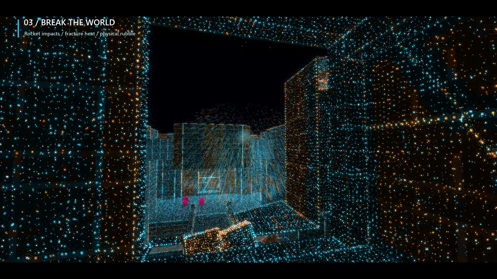

# Particle Quake: Aftershock

**New:** High fidelity and floor reflections are enabled for Neon Cathedral. Separate launcher checkboxes and live console toggles control them. [Fidelity controls and limits](docs/PARTICLE_FIDELITY.md).

A playable Windows x64 vkQuake extension with ten layered particle mesh structures, Vulkan surface splats, and real CPU PhysX + NVIDIA Blast destruction. Rockets can remove complete eligible wall sections, expose their interiors, and create passages the player can walk through. Detached slabs remain physical objects and survive sandbox saves.

This build implements and verifies the central wall-breach experience. It is **not the completed release described by every requirement in `PARTICLE_QUAKE_BUILD_PROMPT.md`**. See [feature status](docs/FEATURES.md) for the implemented, verified, limited, and unfinished areas.

The [Neon Cathedral preset](docs/NEON_CATHEDRAL.md) follows the supplied reference: cyan/gold point-cloud architecture, magenta monsters, bright surface boundaries, dark skies, and screen-space glow.

## Video

[](https://github.com/CrazyKickBoxer/particle-quake-aftershock/releases/download/v0.1.0/ParticleQuake-Aftershock-neon-cathedral.mp4)

Click the image for a 60-second gameplay clip (HEVC/MP4, 1280x720). It plays inline in most browsers; if yours won't play HEVC, download it and open it in VLC or a similar player.

## Play

Open `bin/vkquake_launcher.exe`. Your detected data folder is:

```text
C:\Program Files (x86)\Steam\steamapps\common\Quake\id1
```

Select **Rocket demo setup**, then **Launch Aftershock**, to watch real rockets destroy an automatically extracted wall in `e1m1`. This uses a fixed camera and scripted player inputs, then exits after 540 engine frames. It is an actual Quake weapon test, not a particle-only explosion. Select **Defaults** to return to ordinary interactive play.

The launcher choices are independent:

- **Renderer:** Classic triangles or Particle surfaces.
- **World:** Faithful Quake or Destruction sandbox.
- **Particle structure:** Neon Cathedral, ten mesh/disc shapes, and the original squares. Neon Cathedral, Fine density, and three depth layers are the defaults.
- **Material colors:** Original Quake colors or the existing animated material styles.

See [particle structures](docs/PARTICLE_STRUCTURES.md) for every shape, controls, and behavior.

Use Faithful Quake for ordinary campaigns, demos, and multiplayer. Destruction is a local single-player sandbox; breaking campaign architecture can bypass progression. Only validated closed rectangular structures are currently eligible. Outer map seals, ambiguous solids, and unsupported geometry remain intact.

Quake movement and weapon controls remain available. Press the console key and use:

```text
as_renderer 0             // classic; preserves existing damage
as_renderer 1             // particle; preserves existing damage
as_structure 11          // reference-inspired Neon Cathedral (1..10 meshes; 0 squares)
as_layers 3              // 1..4 independent depth layers, applied live
as_style 0               // faithful appearance (1 enhanced, 2 inferno, 3 inferno-color)
as_explode               // diagnostic explosion along the view direction
as_inspect               // eligible panels, bodies, and physics diagnostics
as_reset                 // reload the original map
as_mode faithful         // change world mode and reload
as_mode destruction      // change world mode and reload
as_effects 0             // disable additional dust/sparks
as_shake 0               // remove additional render-view shake
as_reduced_flashes 1     // reduce additional effect flashes
as_style 5               // Volcanic (new modes use IDs 4 through 13)
as_particle_amount 4     // 1..4; up to 8,192 GPU particles per explosion
as_gibs 1                // directional cosmetic gibs, including native gib proxies
as_goo 1                 // wall splashes, drips and floor smears
as_gore_stats            // gib, collision and decal counters
```

`as_explode` is a debug command. Actual rockets, grenades, and QuakeC explosion temp-entities enter the authoritative destruction event path. Large rubble can obstruct a passage. Small bodies can be pushed by walking; jumping or another explosion can clear a pile.

Normal Quake `save` / `load` uses a matching `.sav.pqas` structural sidecar in destruction mode. Keep both files together. Missing, corrupt, or incompatible sidecars are rejected. Renderer changes do not heal damage; world-mode changes require reloading. Saves are tied to the current geometry/extractor and backend format, not promised portable across future builds.

## Command line

From PowerShell in this directory:

```powershell
& .\bin\vkQuake.exe -basedir 'C:\Program Files (x86)\Steam\steamapps\common\Quake' `
  -userdir "$PWD\bin\userdata" -renderer particle -worldmode destruction `
  -physics physx-cpu -style enhanced -density play -destruction-preset cinematic `
  -window -width 1280 -height 720 +map e1m1
```

Supported values: renderer `classic|particle`, world `faithful|destruction`, physics `off|physx-cpu`, density `play|fine|showcase`, destruction preset `restrained|cinematic|cataclysm`. Appearance includes the original four styles and ten new animated modes: see [particle modes and goo](docs/PARTICLE_MODES.md) for names, controls and limits. `physx-gpu` is explicitly rejected; this build contains no CUDA simulation path. PhysX CPU still requires a Vulkan-capable GPU for vkQuake graphics.

Explicit launch options are reapplied after archived configuration and before `+map`. Density changes take effect when the map reloads. Original PAK/BSP/MDL/SPR and mod search order remain owned by vkQuake. Mission packs and mod folders can be selected in the launcher; they have not received a full compatibility test pass.

The launcher saves `aftershock.ini` beside its executable. If that directory is not writable, it uses `%LOCALAPPDATA%\ParticleQuake\aftershock.ini` and `userdata`. The launcher never copies your PAKs. Samples are cached beneath the selected user directory in `aftershock-cache`.

## Build

Requirements: Windows x64, Git, Visual Studio **2022** Build Tools with Desktop development with C++, v143, Windows SDK, and the bundled CMake component. This snapshot includes the modified `engine` source. Do not replace it with an unmodified vkQuake clone.

```powershell
.\scripts\bootstrap.ps1    # fetch pinned PhysX/Blast and glslang; build dependencies and game
.\scripts\build.ps1        # subsequent Release builds
```

The bootstrap verifies the PhysX commit and shader-tool archive checksum, applies the documented CPU-only SDK build adjustment, builds the native adapter and launcher, compiles/embeds SPIR-V, and builds vkQuake. Only Release x64 is supported by these scripts. Dependency pins and license sources are in [DEPENDENCIES.md](docs/DEPENDENCIES.md).

## Verify and measure

```powershell
$cmake = 'C:\BuildTools\Common7\IDE\CommonExtensions\Microsoft\CMake\CMake\bin'
& "$cmake\ctest.exe" --test-dir build/aftershock -C Release --output-on-failure
.\scripts\test-engine.ps1
.\scripts\test-cache.ps1
.\scripts\test-particle-modes.ps1
.\scripts\test-structures.ps1
.\scripts\test-neon.ps1
.\scripts\benchmark.ps1
.\scripts\record-results.ps1
```

Use the corresponding CMake path if Visual Studio is installed elsewhere. Both game scripts accept `-Quake <base-folder>`. They run game processes sequentially because upstream's `qconsole.log` is shared. Test logs, exact commands, JSON results, and captures stay in ignored `build` folders. The original procedural arena is generated from `tests/arena_generator.cpp`; it still needs your Quake game code to run.

[Validation and measurements](docs/VALIDATION.md) distinguish engine throughput from actual display presentation. [Architecture](docs/ARCHITECTURE.md), [geometry support](docs/GEOMETRY.md), and the [bug journal](docs/BUG_JOURNAL.md) describe the implementation and its limits.

## Packaging and source

`scripts/package.ps1` creates a local executable archive and matching source snapshot under `build/dist`. It excludes user game assets, saves, screenshots, and derived caches. No package is uploaded or published. Keep the source snapshot and notices with the executable archive when handing this build to another developer. Upstream codec binary provenance is recorded in the dependency inventory; a reproducible rebuild of all those codecs remains outstanding.

Aftershock integration code is GPL-2.0-or-later, consistent with the engine. PhysX/Blast at the pinned revision retain their BSD notices. Quake game data is separately owned and must be supplied by the player.

Neon architectural upgrades and visual-only nail ricochets are described in [NEON_NAILS.md](docs/NEON_NAILS.md). Use `as_nails 1` or `toggle as_nails` in the console.
